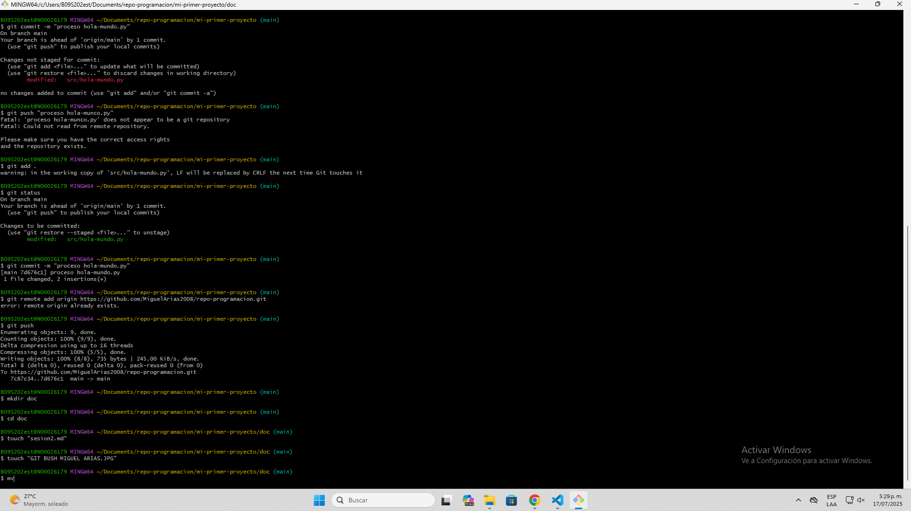

# ¿Como se crea un repositorio nuevo en GitHub?
**R/: Navegamos en GitHub y le damos en mas (+), luego le damos en crear nuevo repositorio, le damos el nombre de nuestra carpeta, en mi caso "mi-primer-proyecto", damos una descripcion pero esta es opcional y por ulitmo le damos en crear repositorio.**

# ¿Como se enlaza con el repo local?
**R/: Metemos el comando git reomte add origin y pegamos el link de nuestra pagina de GitHub del repositorio creado y para verificar que este quedo efectuamos el comando git remote -v.**

# ¿como se sincronizan?
**R/: Metemos el comando git push -u origin main, luego refrescamos la pagina de GitHub y como magia, pum !esta subido¡**

# Imagen referencia:
